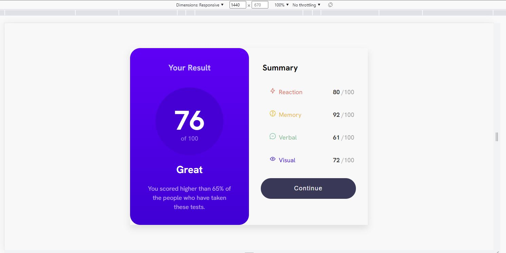

# Frontend Mentor - Results summary component solution

This is a solution to the [Results summary component challenge on Frontend Mentor](https://www.frontendmentor.io/challenges/results-summary-component-CE_K6s0maV). Frontend Mentor challenges help you improve your coding skills by building realistic projects.

## Table of contents

- [Overview](#overview)
  - [The challenge](#the-challenge)
  - [Screenshot](#screenshot)
  - [Links](#links)
- [My process](#my-process)
  - [Built with](#built-with)
  - [What I learned](#what-i-learned)
  - [Continued development](#continued-development)
- [Author](#author)

**Note: Delete this note and update the table of contents based on what sections you keep.**

## Overview

This my Second FrontEndMentor Project which is about building Result-Summary-Component

### The challenge

Users should be able to:

- View the optimal layout for the interface depending on their device's screen size
- See hover and focus states for all interactive elements on the page
  ## Accomplished

### Screenshot

### Links

- Solution URL: [GitHub](https://github.com/Wali1209/results-summary-component-main)
- Live Site URL: [GH-Pages](https://wali1209.github.io/results-summary-component-main/)

## My process

- Creating React + TypeScript Project with Vite@4.2.0
- Installing styled-components as dev-dependencies
- Moving existed project to this new Project
- Initialize Git repository
- Creating React component with styled components
- Building HTML Structure
- Applying styling to the component
- Pushing local Repository of Git to Remote
- Deploying Project to GH-Pages

### Built with

- Semantic HTML5 markup
- CSS
- TypeScript
- [React](https://reactjs.org/) - JS library
- [Styled Components](https://styled-components.com/) - For styles

### What I learned

- To use styled-components with REACT Effectively
- New properties of CSS
- First time using reset.css as global styles
- Learning New feature of Git and GitHub!
- How to Build my Vite Project and how to Deploy it

### Continued development

- I want to add Circular Progress Bar according to the Result.
- and that's it!

## Author

- Frontend Mentor - [@Wali1209](https://www.frontendmentor.io/profile/Wali1209)
- GitHUB - [@Wali1209](https://github.com/Wali1209)
- Facebook - [Wali Hashmi](https://www.facebook.com/mdwali.hashmi.1/)
- Twitter - [@MWali1209](https://twitter.com/MWali1209)
